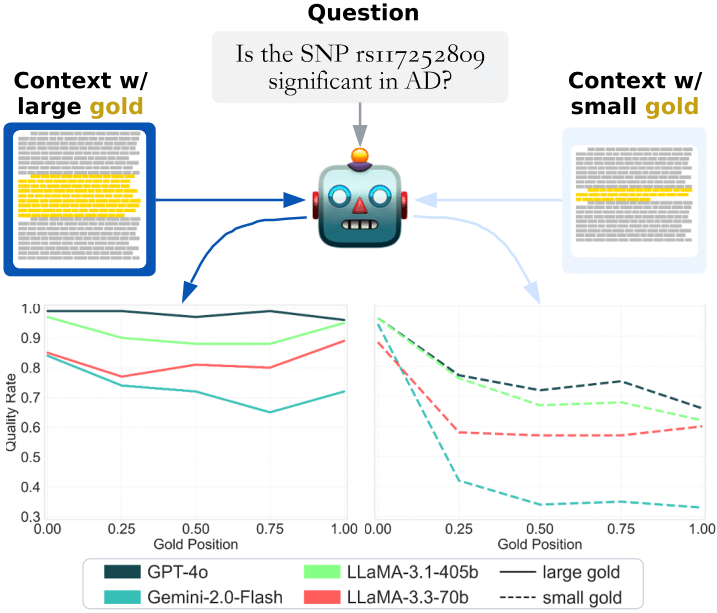

# Lost in the Haystack: Smaller Needles are More Difficult for LLMs to Find

<div align="center">
  
</div>

---

## Environment Setup

We use **Conda** for environment management. Create and activate the environment:

```bash
conda env create -f environment.yml
conda activate lost-in-the-haystack-env
```

## API Keys and `.env` Setup

Modify `example.env` with your private API keys and rename it to `.env`:

```bash
cp example.env .env
# Edit .env with your credentials
```

---

## Data Preparation (Optional)

To recreate benchmark-specific datasets, run the following commands:

* **CARDBiomedBench (CBB)**: Requires retrieval data (not redistributable due to licensing).

  ```bash
  python -m scripts.prep --config configs/benchmarks/cbb.yaml
  ```

* **NaturalQuestions (NQ)**: Requires downloading HELMET data from [here](https://huggingface.co/datasets/princeton-nlp/HELMET) and placing it under `data/raw/`.

  ```bash
  python -m scripts.prep --config configs/benchmarks/nq.yaml
  ```

* **NuminaMath1.5 (NM)**: Automatically fetched from HuggingFace.

  ```bash
  python -m scripts.prep --config configs/benchmarks/nm.yaml
  ```

---

## Running Experiments

Experiments are executed by pairing a model with a benchmark. Example execution:

```bash
python -m scripts.run --exp-config configs/experiments/cbb_gemini2flash.yaml
```

Replace the config path above with the desired benchmark and model combination. Available configs are located under `configs/experiments/`.

---

## Analyzing Results

Analysis can be performed at two levels:

* **Benchmark-wide analysis**:

  ```bash
  python -m scripts.analyze --bench-config configs/benchmarks/cbb.yaml
  ```

* **Model-specific experiment analysis**:

  ```bash
  python -m scripts.analyze --exp-config configs/experiments/cbb_gemini2flash.yaml
  ```

Graphs and analysis outputs are generated automatically.

---

## Repository Structure

```
.
├── configs
│   ├── benchmarks           # Benchmark configurations
│   ├── experiments          # Experiment-specific benchmark_model pairings
│   └── models               # Model configurations
├── data
│   ├── images               # Images and graphs
│   ├── raw                  # Raw input data
│   └── tasks                # Prepared tasks for benchmarks
├── scripts
│   ├── analyze.py           # Analysis entry point
│   ├── run.py               # Experiment execution entry point
│   ├── prep.py              # Data preparation entry point
│   ├── models               # Model initialization and clients
│   │   ├── base_llm.py      # Abstract model class
│   │   ├── ...              # Client-specific llm classes (azure ai, azure openai, google, and huggingface)
│   │   ├── llm_client.py    # LLM Factory
│   └── utils
│       ├── cbb_run.py       # Benchmark-specific run utils
│       ├── nq_run.py
│       ├── nm_run.py
│       ├── cbb_analyze.py   # Benchmark-specific analysis utils
│       ├── nq_analyze.py
│       ├── nm_analyze.py
│       ├── metrics.py       # Metric utilities
│       ├── graph_utils.py   # Visualization utilities
│       └── utils.py         # Helper utilities
├── slurm
│   ├── run_gem2lite.sh      # Example SLURM scripts for HPC execution
│   └── ...
├── .gitignore               # Gitignore file
├── environment.yaml         # Conda environment specification
├── example.env              # Template for API keys
└── README.md                # This document
```

---

## HPC Execution (SLURM)

The `slurm/` directory contains scripts configured for batch execution on HPC clusters using SLURM:

```bash
sbatch slurm/run_gem2lite.sh
```

Ensure paths and environment settings are correct for your HPC environment.

---

## Adding New Models

To add a new LLM:

1. Create a new YAML config file under `configs/models/`.
2. Extend the `base_llm.py` abstract class in `scripts/models/`.

--- 

# Relevant citation: 
```
@article{bianchi2025SmallerNeedles,
	title        = {Lost in the Haystack: Smaller Needles are More Difficult for LLMs to Find},
	author       = {Owen Bianchi and Mathew J. Koretsky and Maya Willey and Chelsea X. Alvarado and Tanay Nayak and Adi Asija and Nicole Kuznetsov and Mike A. Nalls and Faraz Faghri and Daniel Khashabi},
	year         = 2025,
	journal      = {arXiv preprint arXiv:2505.18148},
	volume       = {abs/2505.18148},
	url          = {https://arxiv.org/abs/2505.18148},
	eprint       = {2505.18148},
	archiveprefix = {arXiv},
	primaryclass = {cs.CL},
	code         = {https://github.com/NIH-CARD/LostInTheHaystack},
}
```

---

**Enjoy exploring how LLMs handle varying gold context sizes!**
